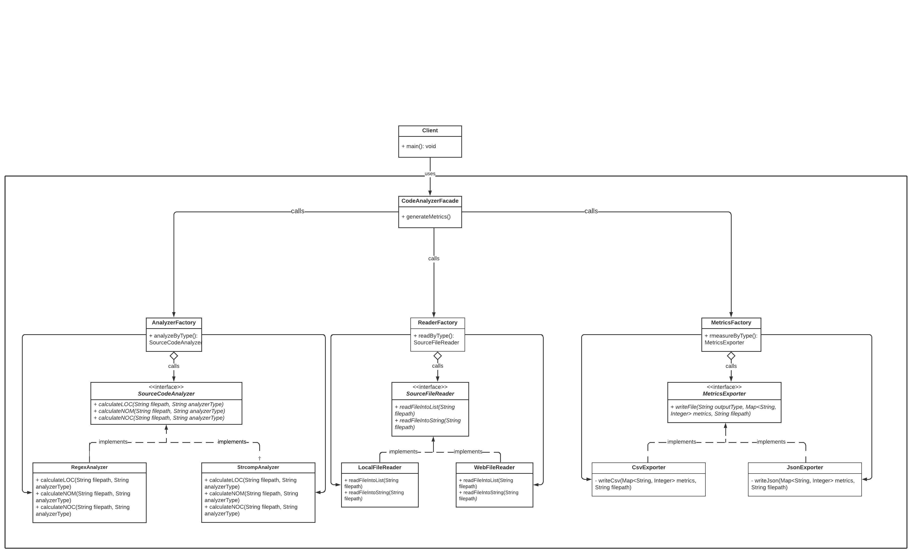

# Source Code Analyzer

The purpose of this module is to get familiarized with <b>Software Design Principles & Patterns</b>. What this module does is that it reads a file and exports its metrics in terms of:
1. Lines of Code (LOC)
2. Number of Methods (NOM)
3. Number of Classes (NOC)

## Getting Started

1. Build the executable Java application with: 

```
mvn package jacoco:report
```

2. Run the executable by executing in the target directory:

```
java –jar “jar-with-dependencies” arg0 arg1 arg2 arg3 arg4
```

were args translate to:<n>
```
arg0 = “JavaSourceCodeInputFile” (e.g., src/test/resources/TestClass.java)<n>
arg1 = “sourceCodeAnalyzerType” [regex|strcomp]<n>
arg2 = “SourceCodeLocationType” [local|web]<n>
arg3 = “OutputFilePath” (e.g., ../output_metrics_file)<n>
arg4 = “OutputFileType” [csv|json]<n>
```
	
<i>example: </i>
```
java –jar ./target/sourcecodeanalyzer-0.0.1-SNAPSHOT-jar-with-dependencies.jar ./src/test/resources/TestClass.java regex local metrics_results csv
```


## The Logic behing the Design of the SourceCodeAnalyzer module

The module's design is based on the <b>SOLID Design Principles</b>.What he acronym "SOLID" stands for is:

1. <b>S</b>ingle Responsibility Principle, which represents that every class should only have one reason to change
2. <b>O</b>pen-closed Principle, which represents that every entity should be open for extension, but closed for modification
3. <b>L</b>iskov Substitution Principle, which represents that the objects in a program should be replacaeble with instances of their subtypes without altering the correctness of the program
4. <b>I</b>nterface Segregation Principle, which represents that many client-specific interfaces are better than one general-purpose interface
5. Dependency In<b>v</b>ersion, which represents that one entity should depend upon abstractions and not concretions

<i><b>More specifically</b></i>

I have included <b>3</b> of the [23 GoF Design Patterns](https://springframework.guru/gang-of-four-design-patterns/) and these are:
1. Strategy Pattern
2. Factory Pattern
3. Facade Pattern

So, analyzing the design of the code bottom-top wise, as you can see I have applied the Strategy Pattern thrice. I have created 3 <b>Interfaces</b>: the <i>SourceCodeAnalyzer</i>, the <i>SourceFileReader</i> and the <i>MetrcisExporter</i>, one that implements the classes for reading the file to be analyzed, one that implements the classes for analyzing the code and one that implements the classes for exporting the metrcis of the code respectively. I chose to create these interfaces because, contrary to the initial form of the code, this way any change in any of the classes included in these interfaces can be applied, without requiring a change in more that one place. Moreover, this way each class is responsible for only one functionality. This design honors the <b>Single Responsibility Principle</b>, the <b>Liskov Substitution Principle</b> and the <b>Interface Segregation Principle</b>. Also, as I mentioned, the <i>Strategy Pattern</i> is applied here because each modification that leads to the creation of an interface represents a Strategy Pattern.

Moving up to the middle layer, as you can notice I have applied the Factory Pattern thrice, each one for every Interface/Strategy Pattern. I have created 3 <b>Factories</b>: the <b>AnalyzerFactory</b>, the <b>ReaderFactory</b> and the <b>MetricsFactory</b>, one that calls the Interface which includes the classes that read the file, on that calls the Interface which includes the classes that analyze the code and one that calls the Interface which includes the classes that export the metrics respectively. This way, eache one of these factories represents an entity that can be extended with other functionalities, but not modified.This design, as opposed to the priliminary form of the code, honors the <b>Open-closed Principle</b> and the <b>Dependency Inversion</b> principle because the interpolation of the Factory between the Client and the Interface makes the Client less dependent on the source code and lets the Factory "decide" which class of the Interface is suitable every time.

Last but not least, moving to the upper level of the UML Class Diagram, as you can see I have used the <b>Facade Pattern</b> as an interpolation class between the Client and the Factories. I decided to create a Facade class because every Factory, represents a complete functionality on its own, but also these three factories combined represent another completed functionality, like a library. This design decouples the Client from the rest of the system and layers the system by defining an entry point to each subsystem.

However, it is important to acknowledge the fact that there is a tradeoff: although the Client is finally decoupled and independent from the rest of the system and there is a higher level of Hierarchy, there is also now a much higher level of complexity.
	
## UML Class Diagram of the SourceCodeAnalyzer Module

You can see the UML Class Diagram of the SourceCodeAnalyzer module here:



